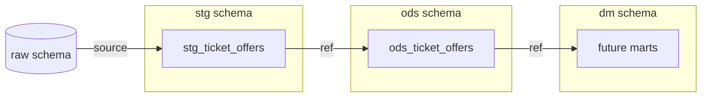

# Структура dbt-проекта

Внутренняя структура dbt-проекта для построения аналитических слоёв в DWH

## Схема слоев данных



## Структура каталогов

```text
dbt_project/
├── dbt_project.yml       # конфигурация проекта (материализации, схемы)
├── profiles.yml          # профиль подключения к PostgreSQL
├── packages.yml          # зависимости (Elementary)
│
├── models/               # SQL-модели данных
│   ├── sources.yml       # определение source-таблиц (raw.*)
│   ├── stg/              # staging слой
│   │   └── stg_ticket_offers.sql
│   ├── ods/              # ODS слой
│   │   └── ods_ticket_offers.sql
│   └── dm/               # data marts
│
├── macros/               # макросы и Jinja-шаблоны
│   └── get_custom_schema.sql
│
├── tests/                # data/schema тесты
├── analyses/             # ad-hoc аналитические запросы
├── seeds/                # CSV-справочники
└── snapshots/            # SCD2-снепшоты
```

## Слои данных

### `raw`

- **Назначение**: "сырые" данные, загруженные из MongoDB через Airflow
- **Таблицы**: `raw.aviasales_api_log` (с SCD2-полями `valid_from_dttm`, `valid_to_dttm`)
- **Определение**: `models/sources.yml`
- **Freshness**: проверяется dbt (warn после 1 дня, error после 2 дней)

### `stg` (staging)

- **Назначение**: очистка, фильтрация, типизация данных из raw
- **Материализация**: `table`
- **Схема**: `stg`
- **Модели**:
  - `stg_ticket_offers.sql` — актуальные записи из `raw.aviasales_api_log` (фильтр `valid_to_dttm = '5999-12-31'` + endpoint авиабилетов)

### `ods` (Operational Data Store)

- **Назначение**: нормализованные данные (JSON → колонки)
- **Материализация**: `incremental`
- **Схема**: `ods`
- **Модели**:
  - `ods_ticket_offers.sql` — инкрементальная модель, разворачивает массив `response.data` в отдельные строки с деталями билетов (цена, маршрут, авиакомпания, даты)

### `dm` (Data Marts)

- **Назначение**: бизнес-витрины для аналитики и дашбордов
- **Материализация**: `table`
- **Схема**: `dm`
- **Модели**

## Конфигурация

### `dbt_project.yml`

Основные настройки:

```yaml
models:
  dbt_project:
    stg:
      +materialized: table
      +schema: stg
      +grants:
        select: [ 'md_ticket_user' ]
    
    ods:
      +materialized: table
      +schema: ods
      +grants:
        select: [ 'md_ticket_user' ]
    
    dm:
      +materialized: table
      +schema: dm
      +grants:
        select: [ 'md_ticket_user' ]
```

### `profiles.yml`

Подключение к PostgreSQL через переменные окружения:

```yaml
dbt_project:
  target: dev
  outputs:
    dev:
      type: postgres
      host: "{{ env_var('POSTGRES_HOST') }}"
      user: "{{ env_var('POSTGRES_USER') }}"
      password: "{{ env_var('POSTGRES_PASSWORD') }}"
      port: 5432
      dbname: "{{ env_var('POSTGRES_DB') }}"
      schema: public
```

### `packages.yml`

Зависимости dbt-пакетов:

```yaml
packages:
  - package: elementary-data/elementary
    version: 0.15.1
```

**Elementary** — инструмент для мониторинга данных и dbt-моделей (тесты, freshness, lineage)

## Макросы

### `macros/get_custom_schema.sql`

Переопределяет стандартное поведение dbt: схемы создаются **без префикса target.schema** (т.е. `stg` вместо `public_stg`).

## Команды dbt

### Локальная разработка (в контейнере)

```bash
# войти в контейнер
docker compose run --rm dbt bash

# проверить подключение
dbt debug

# установить зависимости
dbt deps

# запустить все модели
dbt run

# запустить только stg-слой
dbt run --select stg.*

# запустить тесты
dbt test

# генерация документации
dbt docs generate
dbt docs serve
```

### Запуск через Airflow

В продакшене dbt-модели запускаются через Airflow DAG (по расписанию после загрузки данных в `raw`).

## Мониторинг: Elementary

После установки пакета Elementary:

```bash
# внутри контейнера dbt
edr monitor  # запустить тесты Elementary
edr report   # сгенерировать HTML-отчёт в elementary_reports/
```

HTML-отчёт можно открыть через сервис `elementary` (настроен в docker-compose):

```
http://localhost:5003
```

## Тестирование

### Встроенные тесты dbt

Определяются в `schema.yml` файлах рядом с моделями:

```yaml
models:
  - name: stg_ticket_offers
    columns:
      - name: id
        tests:
          - unique
          - not_null
```