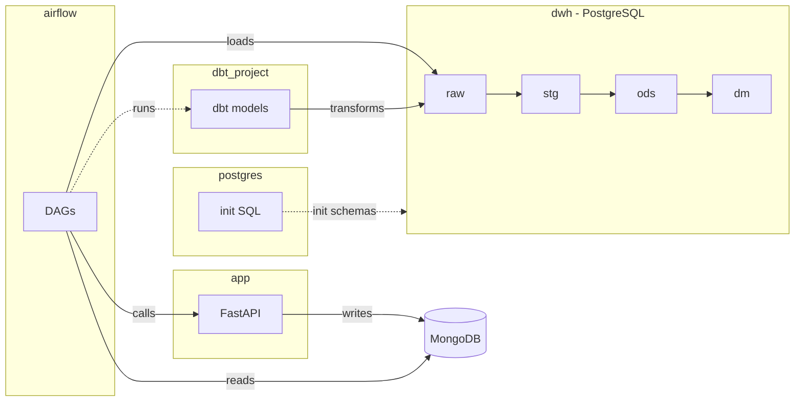

# Верхнеуровневая структура решения

```text
.
├── app/          # прикладной сервис (API/сбор данных)
├── airflow/      # оркестрация пайплайнов (DAG’и)
├── dwh           # хранилище данных (логически): Postgres + DDL в postgres/
├── postgres/     # bootstrap DWH: init SQL (схемы/таблицы)
└── dbt_project/  # трансформации данных (dbt-модели)
```

## Схема



## Компоненты

### `app/` — прикладной сервис (FastAPI)

- **Назначение**: слой приложения, который предоставляет HTTP API и содержит код сбора/подготовки данных
- **Что внутри (по структуре)**:
  - **`main.py`**: точка входа FastAPI
  - **`routes/`**: HTTP-эндпоинты
  - **`utils/`**: прикладная логика (коллекторы, проверки доступности БД, вспомогательные функции)
  - **`requirements.txt` / `Dockerfile`**: зависимости и сборка образа
  - **`city_codes.txt`**: вспомогательные данные для работы коллектора

### `airflow/` — оркестрация (Airflow DAG)

- **Назначение**: слой оркестрации — расписания, зависимости задач и управление выполнением пайплайнов
- **Что внутри (по структуре)**:
  - **`dags/`**: DAG-файлы и общие настройки DAG
    - `common.py`: общие параметры/константы
    - отдельные DAG’и: задачи вызова сервиса, переноса данных
  - **`requirements.txt` / `Dockerfile`**: зависимости и сборка образа
  - **`logs/`**: локальные логи Airflow

### `dwh` — хранилище данных

- **Назначение**: централизованное аналитическое хранилище на **PostgreSQL**
- **Как представлено в репозитории**:
  - **`postgres/init`**: SQL-скрипт инициализации, который создает схемы/таблицы
  - **Postgres-контейнер/сервис**: определяется в docker-compose конфигурации

### `dbt_project/` — трансформации (dbt)

- **Назначение**: слой EL-трансформаций в DWH (построение моделей/слоев, тесты)
- **Что внутри (по структуре)**:
  - **`dbt_project.yml`**: конфигурация проекта (пути, схемы для слоев)
  - **`profiles.yml`**: профиль подключения dbt к Postgres
  - **`models/`**: SQL-модели по слоям
  - **`macros/`**: макросы/шаблоны SQL
  - **`tests/`**: тесты dbt
  - **`packages.yml`**: зависимости dbt-пакетов

